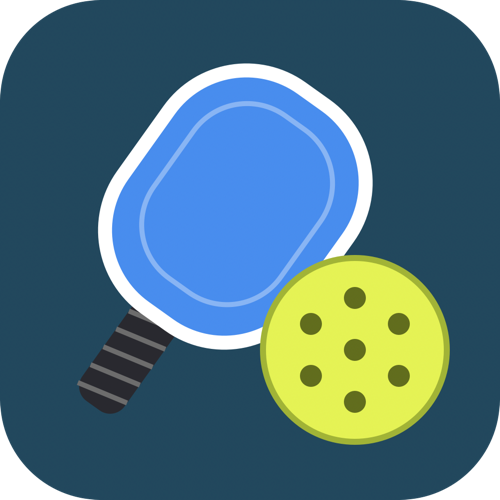

# 簡單匹克球計分 / Easy Pickleball Score

Garmin Connect IQ 手錶 App：用實體按鍵幫匹克球比賽計分，自動處理發球權、發球區與叫分。
A Garmin Connect IQ watch app for keeping pickleball scores with the physical buttons.



## 功能
- 發球得分（side-out）與落地得分（rally）兩種賽制；單打／雙打（雙打發球得分制開局 0-0-2）
- 11 / 13 / 15 / 17 / 19 / 21 分制，Deuce（需領先 2 分）可開關
- 身分：**選手**（我方／對手，並錄製匹克球活動，記錄時間、心率、卡路里）或**記錄員**（左方／右方，不錄製）
- 比賽畫面：雙方大比分、發球方以黃色標示、小球場圖顯示發球員站位、底部叫分（發球方-接發方-發球員）
- 每得一分短震動，比賽結束長震動；可無限次復原
- 語言：繁體中文、English、日本語、Tiếng Việt、Español（跟隨手錶系統語言）

## 操作
| 按鍵 | 比賽中 |
|---|---|
| UP（左中） | 我方（左邊）得分 |
| DOWN（左下） | 對手（右邊）得分 |
| BACK（右下） | 復原上一分；0-0 時回到設定 |
| START（右上） | 選單：復原／重新開始／回到設定／離開 |
| 觸控（有觸控的機型） | 點左半／右半螢幕，同 UP／DOWN |

設定選單：開始比賽、先發球、身分、賽制、幾分獲勝、Deuce、單雙打。每選一次切換到下一個值，會記住上次設定。

## 活動錄製（選手模式）
- 開始比賽即開始錄製；比賽結束暫停計時，復原繼續比賽則恢復計時
- 比完後離開（重新開始／回到設定／離開）自動儲存
- 沒比完就離開會詢問儲存或捨棄；0-0 就離開則直接捨棄

## 建置
需要 [Connect IQ SDK](https://developer.garmin.com/connect-iq/sdk/) 與開發者金鑰：

```sh
SDK="$(cat ~/Library/Application\ Support/Garmin/ConnectIQ/current-sdk.cfg)"
# 單一機型（例：Descent Mk2 / Mk2i）
"$SDK/bin/monkeyc" -f monkey.jungle -d descentmk2 -o bin/PickleballScore.prg -y <developer_key.der>
# 上架用 .iq（所有機型）
"$SDK/bin/monkeyc" -e -r -f monkey.jungle -o bin/PickleballScore.iq -y <developer_key.der>
```

## 隱私權
見 [PRIVACY.md](PRIVACY.md)。
